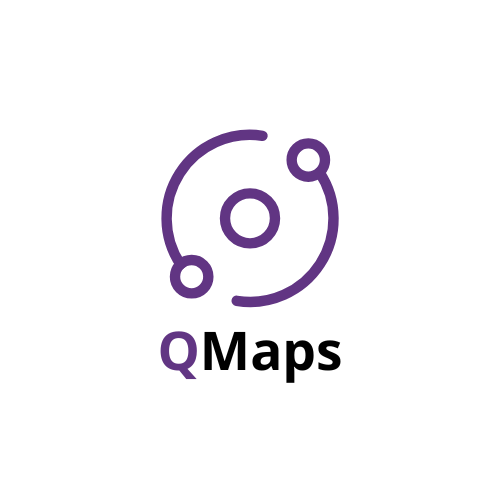

# QMaps 

Maps application that uses quantum randomness to generate directions and marker points

## 🚧 Work In Progress

**⚠️ This application is still under development and is not yet ready for production use. It is not installable or usable at the moment.**

The app is being actively worked on, and updates will be made to the README as the project becomes stable and usable.

